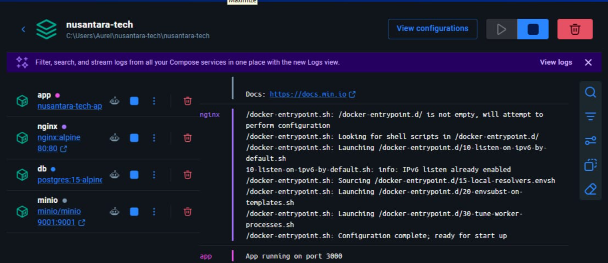
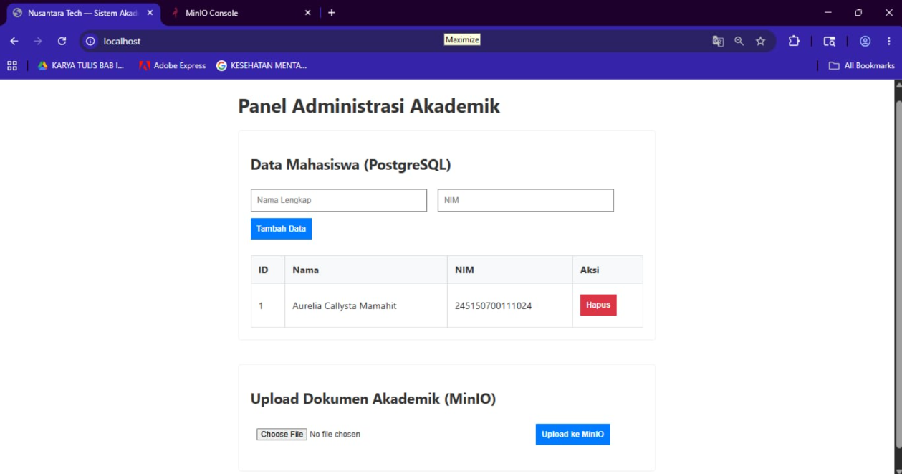
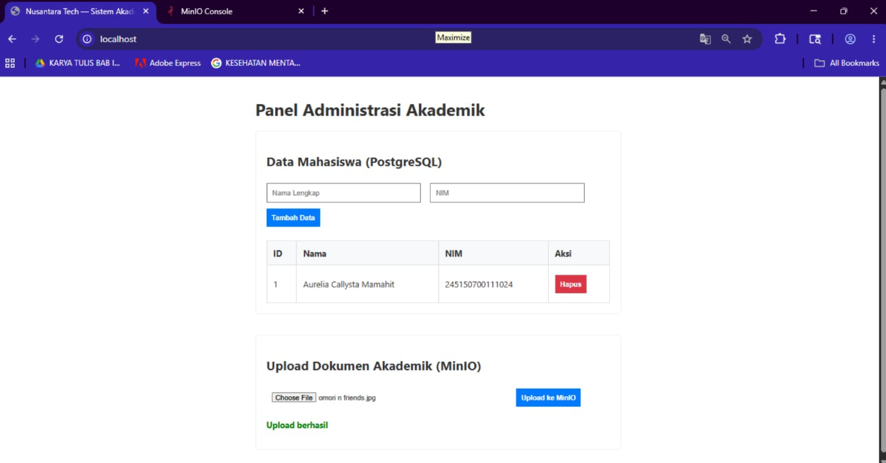
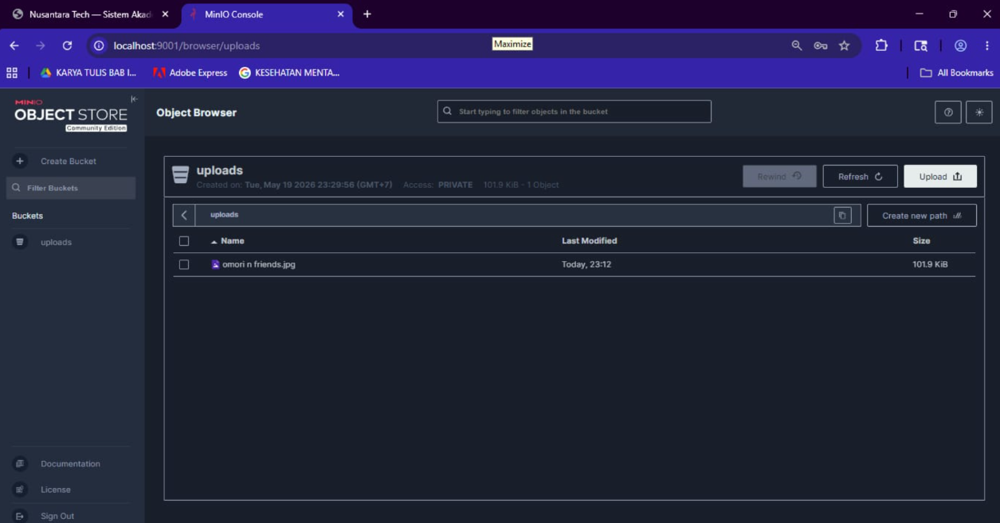

# Nusantara Tech — Sistem Akademik

> Aplikasi web berbasis **Node.js + Docker** untuk manajemen data mahasiswa dan penyimpanan dokumen akademik menggunakan **PostgreSQL** sebagai database relasional dan **MinIO** sebagai object storage.

Project ini dikembangkan sebagai bagian dari tugas kelompok mata kuliah Container & Virtualization, dengan pendekatan multi-container menggunakan Docker Compose dan reverse proxy Nginx.

---

## Daftar Isi

- [Fitur Aplikasi](#-fitur-aplikasi)
- [Teknologi yang Digunakan](#-teknologi-yang-digunakan)
- [Struktur Project](#-struktur-project)
- [Cara Menjalankan Project](#-cara-menjalankan-project)
- [Cara Mengakses Aplikasi](#-cara-mengakses-aplikasi)
- [Cara Testing Upload](#-cara-testing-upload)
- [Screenshot Hasil Pengujian](#-screenshot-hasil-pengujian)
- [Dokumentasi API / Endpoint](#-dokumentasi-api--endpoint)
- [Environment Variables](#-environment-variables)
- [Kendala dan Solusi](#-kendala-dan-solusi)
- [Anggota Kelompok](#-anggota-kelompok)

---

## Fitur Aplikasi

- **Manajemen Data Mahasiswa** — Tambah dan hapus data mahasiswa (Nama & NIM) yang tersimpan di database PostgreSQL secara real-time.
- **Upload Dokumen Akademik** — Upload file dokumen dari browser langsung ke MinIO Object Storage.
- **Cek Koneksi Database** — Endpoint untuk memverifikasi koneksi ke PostgreSQL.
- **Object Storage Otomatis** — Bucket `uploads` dibuat otomatis saat aplikasi pertama kali dijalankan.
- **Reverse Proxy dengan Nginx** — Seluruh request HTTP masuk melalui Nginx di port 80, lalu diteruskan ke Node.js di port 3000.
- **Full Containerized** — Semua service berjalan dalam container Docker yang terisolasi dan dikelola dengan Docker Compose.

---

## Teknologi yang Digunakan

| Teknologi | Versi | Fungsi |
|---|---|---|
| **Node.js** | 20 (Alpine) | Runtime JavaScript untuk backend |
| **Express.js** | ^4.18.2 | Framework web server |
| **PostgreSQL** | 15 (Alpine) | Database relasional |
| **MinIO** | latest | Object Storage (S3-compatible) |
| **Nginx** | Alpine | Reverse proxy |
| **Docker** | latest | Container runtime |
| **Docker Compose** | v3.8 | Orkestrasi multi-container |
| **Multer** | ^1.4.5-lts.1 | Middleware upload file |
| **minio (npm)** | ^7.1.3 | MinIO client untuk Node.js |
| **pg** | ^8.11.0 | PostgreSQL client untuk Node.js |

---

## Struktur Project

```
nusantara-tech/
├── app/
│   ├── public/
│   │   └── index.html          # Tampilan frontend (UI browser)
│   ├── src/
│   │   ├── index.js            # Entry point server & logika database
│   │   └── upload.js           # Handler upload file ke MinIO
│   ├── .dockerignore           # File yang dikecualikan dari Docker build
│   ├── Dockerfile              # Konfigurasi build image Node.js
│   └── package.json            # Dependensi Node.js
├── nginx/
│   └── nginx.conf              # Konfigurasi reverse proxy Nginx
├── .env                        # Environment variables (tidak di-commit)
├── .env.example                # Template environment variables
├── .gitignore                  # File yang dikecualikan dari Git
└── docker-compose.yml          # Definisi semua service container
```

### Penjelasan Service Container

| Container | Image | Fungsi |
|---|---|---|
| `app` | Build dari `./app` | Backend Node.js/Express |
| `db` | `postgres:15-alpine` | Database PostgreSQL |
| `minio` | `minio/minio` | Object Storage |
| `nginx` | `nginx:alpine` | Reverse proxy (port 80) |

---

## Cara Menjalankan Project

### Prasyarat

Pastikan sudah terinstall:
- [Git](https://git-scm.com/)
- [Docker Desktop](https://www.docker.com/products/docker-desktop/) (sudah include Docker Compose)

---

### Langkah 1 — Clone Repository

```bash
git clone https://github.com/hikarl1/nusantara-tech.git
cd nusantara-tech
```

---

### Langkah 2 — Setup Environment Variables

Salin file `.env.example` menjadi `.env`:

```bash
# Windows (PowerShell)
Copy-Item .env.example .env

# Linux / macOS
cp .env.example .env
```

Buka file `.env` dan sesuaikan nilainya:

```env
POSTGRES_USER=admin
POSTGRES_PASSWORD=nusantara
POSTGRES_DB=nusantara

MINIO_ROOT_USER=minioadmin
MINIO_ROOT_PASSWORD=minioadmin123

APP_PORT=3000
```

> **Penting:** File `.env` tidak akan di-push ke GitHub karena sudah ditambahkan ke `.gitignore`. Jangan pernah menyimpan password asli di `.env.example`.

---

### Langkah 3 — Build dan Jalankan Semua Container

```bash
docker-compose up --build -d
```

Penjelasan flag:
- `--build` → Memaksa Docker membangun ulang image dari Dockerfile
- `-d` → Menjalankan container di background (detached mode)

Docker akan otomatis:
1. Menarik image `nginx:alpine`, `postgres:15-alpine`, dan `minio/minio`
2. Membangun image Node.js dari `app/Dockerfile`
3. Membuat network `nusantara-net` dan volume `db-data`, `minio-data`
4. Menjalankan 4 container sekaligus

---

### Langkah 4 — Verifikasi Container Berjalan

```bash
docker-compose ps
```

Semua container harus berstatus **Running** / **Healthy**:

```
Container minio    Started
Container db       Healthy
Container app      Started
Container nginx    Started
```

Untuk melihat log secara real-time:

```bash
docker-compose logs -f
```

Untuk menghentikan semua container:

```bash
docker-compose down
```

---

## Cara Mengakses Aplikasi

### Aplikasi Web Utama

| Keterangan | Detail |
|---|---|
| **URL** | http://localhost |
| **Port** | 80 (melalui Nginx reverse proxy) |
| **Diteruskan ke** | Node.js di port 3000 |

Buka browser dan akses: **http://localhost**

Anda akan melihat **Panel Administrasi Akademik** dengan dua fitur utama:
- Form tambah/hapus data mahasiswa (terhubung ke PostgreSQL)
- Form upload dokumen (terhubung ke MinIO)

---

### Dashboard MinIO (Object Storage)

| Keterangan | Detail |
|---|---|
| **URL Dashboard** | http://localhost:9001 |
| **Port API** | 9000 |
| **Port Console** | 9001 |
| **Username** | `minioadmin` (dari `.env`) |
| **Password** | `minioadmin123` (dari `.env`) |
| **Bucket penyimpanan** | `uploads` (dibuat otomatis) |

Langkah akses:
1. Buka browser → http://localhost:9001/login
2. Masukkan **Username**: `minioadmin`
3. Masukkan **Password**: `minioadmin123`
4. Klik **Login**
5. Di sidebar kiri, klik **Buckets** → pilih bucket **uploads**
6. File yang terupload akan tampil di **Object Browser**

---

## Cara Testing Upload

### Testing Upload File ke MinIO

1. Buka aplikasi web di **http://localhost**
2. Scroll ke bagian **"Upload Dokumen Akademik (MinIO)"**
3. Klik tombol **"Choose File"** → pilih file dari komputer Anda
4. Klik tombol **"Upload ke MinIO"**
5. Jika berhasil, akan muncul pesan: **"Upload berhasil"**

### Verifikasi File di MinIO Dashboard

1. Buka **http://localhost:9001**
2. Login dengan kredensial di atas
3. Navigasi ke **Buckets → uploads → Object Browser**
4. File yang baru diupload akan muncul dengan nama file dan ukurannya

### Testing Koneksi Database (PostgreSQL)

1. Buka aplikasi web di **http://localhost**
2. Isi form **"Nama Lengkap"** dan **"NIM"**
3. Klik **"Tambah Data"**
4. Data mahasiswa akan tampil di tabel di bawah form
5. Tabel ini mengambil data langsung dari PostgreSQL — jika data muncul, koneksi database berjalan normal

### Memastikan Koneksi Database dan Object Storage Terhubung

```bash
# Cek log aplikasi Node.js
docker-compose logs app

# Jika koneksi berhasil, akan terlihat log:
# App running on port 3000
# Bucket "uploads" berhasil dibuat otomatis
```

---

## Screenshot Hasil Pengujian

### 1. Container Berjalan di Docker Desktop



> Tampilan Docker Desktop menunjukkan 4 container aktif: `app`, `nginx`, `db`, dan `minio`.

---

### 2. Tampilan Aplikasi Web



> Aplikasi web diakses di http://localhost menampilkan Panel Administrasi Akademik dengan data mahasiswa dari PostgreSQL dan form upload ke MinIO.

---

### 3. Upload File Berhasil



> Pesan "Upload berhasil" muncul setelah file berhasil dikirim dari browser ke MinIO Object Storage.

---

### 4. File Berhasil Masuk ke Bucket MinIO



> File yang diupload tersimpan di bucket `uploads` pada MinIO Object Storage, lengkap dengan informasi nama file, waktu upload, dan ukuran file.

---

## Dokumentasi API / Endpoint

| Method | Endpoint | Deskripsi |
|---|---|---|
| `GET` | `/` | Menampilkan halaman utama frontend (`index.html`) |
| `GET` | `/mahasiswa` | Mengambil semua data mahasiswa dari PostgreSQL |
| `POST` | `/mahasiswa` | Menambahkan data mahasiswa baru |
| `DELETE` | `/mahasiswa/:id` | Menghapus data mahasiswa berdasarkan ID |
| `POST` | `/upload` | Upload file tunggal ke MinIO bucket `uploads` |

### Contoh Request

**Tambah Mahasiswa:**
```http
POST /mahasiswa
Content-Type: application/json

{
  "nama": "Aurelia Callysta Mamahit",
  "nim": "245150700111024"
}
```

**Upload File:**
```http
POST /upload
Content-Type: multipart/form-data

file: [binary file data]
```

---

## Environment Variables

Berdasarkan file `.env.example`:

| Variable | Default Value | Deskripsi |
|---|---|---|
| `POSTGRES_USER` | `admin` | Username untuk koneksi PostgreSQL |
| `POSTGRES_PASSWORD` | _(kosong)_ | Password untuk koneksi PostgreSQL |
| `POSTGRES_DB` | `akademik` | Nama database PostgreSQL |
| `MINIO_ROOT_USER` | `minioadmin` | Username root MinIO |
| `MINIO_ROOT_PASSWORD` | _(kosong)_ | Password root MinIO |
| `APP_PORT` | `3000` | Port internal aplikasi Node.js |

> **Tips:** Salin `.env.example` ke `.env` dan isi nilai yang kosong sebelum menjalankan Docker Compose.

---

## Kendala dan Solusi

### Error: `dockerfile parse error on line 1: unknown instruction`

**Penyebab:** Nama file Dockerfile salah casing (misal `dockerfile` bukan `Dockerfile`).

**Solusi:**
```bash
# Rename file (Linux/macOS)
mv app/dockerfile app/Dockerfile

# Lalu jalankan ulang
docker-compose up --build -d
```

---

### Container `app` tidak bisa terkoneksi ke `db`

**Penyebab:** Container database belum siap menerima koneksi saat app startup.

**Solusi:** Pastikan `docker-compose.yml` memiliki `depends_on: db` dan `db` sudah dalam kondisi `Healthy`. Tunggu beberapa detik lalu restart container app:
```bash
docker-compose restart app
```

---

### Upload file gagal / error 400

**Penyebab:** Tidak ada file yang dipilih sebelum klik tombol upload.

**Solusi:** Pastikan memilih file terlebih dahulu menggunakan tombol "Choose File" sebelum klik "Upload ke MinIO".

---

### MinIO dashboard tidak bisa diakses di port 9001

**Penyebab:** Container MinIO belum selesai startup atau port konflik.

**Solusi:**
```bash
# Cek status container minio
docker-compose logs minio

# Pastikan command di docker-compose.yml menggunakan:
# command: server /data --console-address ":9001"
```

---

### `version` attribute is obsolete warning

**Penyebab:** Docker Compose versi terbaru menganggap atribut `version: '3.8'` sudah usang.

**Solusi:** Ini hanya peringatan (warning), bukan error. Aplikasi tetap berjalan normal. Untuk menghilangkan warning, hapus baris `version: '3.8'` dari `docker-compose.yml`.

---

## Anggota Kelompok

**Kelompok 4 — Case Based 2**

| No | Nama | NIM |
|---|---|---|
| 1 | _Hillan Tazidi Tsalits_ | _235150700111027_ |
| 2 | _Aurelia Callysta Mamahit_ | _245150700111024_ |
| 3 | _Anggita Putri Savelya Nadeak_ | _245150700111026_ |
